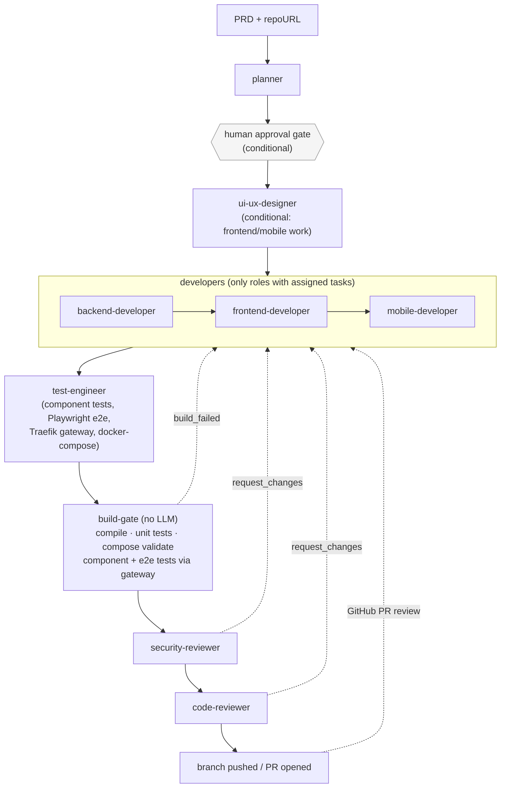
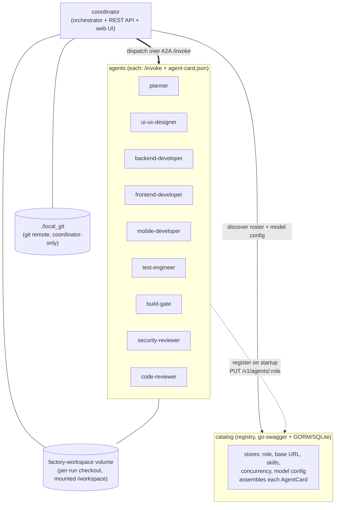

# AI Software Factory

Submit a **PRD** (Product Requirements Definition); a network of specialized AI
agents collaborates to produce a feature as a **Pull Request** for human review.

Agents talk to each other over the [A2A protocol](https://a2a-protocol.org/)
using [`a2a-go`](https://github.com/a2aproject/a2a-go). Everything is Go.

> **Status: Phase 5.** The full agent roster (planner, UI/UX designer, backend /
> frontend / mobile developers, **test engineer**, **build gate**, security
> reviewer, code reviewer); the coordinator loop with a **feedback loop** (reviewers and the build gate
> route `request_changes` back to a developer until they pass or a per-stage cap
> trips), a **human approval gate** after planning, **real git repositories**
> (new / local clone + push / remote clone + push + GitHub PR), a **build/test gate**
> that compiles, tests, and deploys every commit (through a generated **Traefik**
> gateway, exercised by generated **Playwright** e2e tests) before the reviewers
> see it, a **GitHub PR-review webhook** that re-enters the factory when someone
> reviews the PR, **durable async runs** with a per-run event log, and a **web
> UI** at `http://localhost:8090` — runs kanban, per-run timeline, PR revision
> history, A2A catalog, approve / request-changes controls. See
> [`plan_next.md`](plan_next.md).

## Architecture

### Pipeline workflow

What happens, in order, for one run. Conditional stages only run when the
planner assigned them work; the dashed edges are the feedback loop — a failed
gate or review bounces back to the responsible developer instead of failing the
run, bounded by a per-role attempt cap (default 3).



- **catalog** — REST service (`go-swagger`, spec-first: `api/catalog.swagger.yml`).
  Stores each agent's A2A registration **and** its model configuration, and
  assembles the agent's `AgentCard`.
- **coordinator** — accepts a PRD + a `repoURL` (`api/coordinator.swagger.yml`),
  resolves a per-run workspace, and drives the loop. `POST /v1/prd` returns
  immediately; poll `GET /v1/runs/{id}`, and drive the approval gate with
  `POST /v1/runs/{id}/approve` | `/reject`. The **planner** emits a structured
  task list plus an `approval` decision; if it flags the plan non-trivial the run
  pauses at `awaiting_approval`. Reviewers return a verdict — on `request_changes`
  the run loops back to a developer with the findings, bounded by a per-stage
  attempt cap inside the run's **TTL / budget**; exhaustion → `needs_human_review`.
  On finish: a remote repo gets its branch pushed and a GitHub PR opened
  (`pr_open`), otherwise `pr_ready`. Runs persist in a SQLite store (`--runstore`)
  and survive a coordinator restart.
- **agents** — A2A agents built on `internal/agentkit` (register with the
  catalog, fetch model config, serve `/.well-known/agent-card.json` + `/invoke`).
  Developers write files into the checkout; **`test-engineer`** then writes a
  component-test suite, a Playwright e2e suite, and the deployment glue (a
  generated Traefik gateway + `docker-compose.yml`); **`build-gate`**
  (`internal/buildgate`, no LLM) compiles, tests, and deploys the workspace,
  bouncing a broken commit back to its author; `security-reviewer` runs SAST
  (gosec / govulncheck / `npm audit`) plus an LLM pass; `code-reviewer` shells
  out to the [Kodus](https://kodus.io/) CLI.
- **web UI** — a Vue 3 SPA (`browser/asf-ui`) served by the coordinator at `/`,
  same-origin with its API. See [Web UI](#web-ui).

### A2A service architecture

The pipeline diagram above shows *what happens in what order* for one run. This
shows *what talks to what*, independent of any run: the catalog is a
registry/config store, not a message broker — the coordinator discovers agents
through it but dispatches work **directly** to each agent over A2A.



Each agent's `AgentCard` carries its Claude model config (`provider` / `model` /
`maxTokens` / `effort` / `thinking`) as a custom A2A capability extension
(`internal/modelext`, `AgentCard.Capabilities.Extensions`) — so unlike a typical
single-model setup, every role can run a different model, set per-agent in
`agent_prompts/<role>.md` and re-asserted into the catalog on every restart. See
["The model to use"](#the-model-to-use).

### Agents

| Role | Purpose |
|---|---|
| `planner` | PRD → implementation plan + task list + approval decision |
| `ui-ux-designer` | UI/UX spec for frontend/mobile work (conditional) |
| `backend-developer` | Go, spec-first REST via `go-swagger` |
| `frontend-developer` | Vue 3 SPA via Vite |
| `mobile-developer` | React Native (Expo), conditional on mobile tasks |
| `test-engineer` | component tests, Playwright e2e, Traefik gateway, docker-compose |
| `build-gate` | deterministic compile/test/deploy gate — no LLM |
| `security-reviewer` | SAST (gosec / govulncheck / `npm audit`) + LLM pass |
| `code-reviewer` | [Kodus](https://kodus.io/) CLI + LLM summary |

Each is defined entirely by a prompt file — see [Agent prompts](#agent-prompts).

### Build agents

The three developer agents are where a feature's actual code comes from. They
share the same Go executor (`internal/agents/devagent`) and differ only in
their prompt:

- **`backend-developer`** — Go, spec-first REST via `go-swagger` (OpenAPI spec
  in `api/`, generated server code, hand-written handlers), in-memory or
  SQLite/GORM persistence, table-driven tests, multi-stage `Dockerfile`.
- **`frontend-developer`** — Vue 3 (`<script setup>`) SPA, Vite build,
  vue-router, optional Pinia, axios; multi-stage `Dockerfile` (or none if the
  backend serves the SPA).
- **`mobile-developer`** — React Native (TypeScript), Expo-managed; only runs
  when tasks are tagged `mobile`; not deployed via Docker/compose.

### Testing

`test-engineer` writes the test suites and deployment glue right after the
developers; `build-gate` then executes and gates on all of it, in this order:

1. **Unit tests** — `go test ./...` (backend), `npm test` (frontend/mobile,
   when a real test script exists).
2. **Component/API tests** — a dependency-free Go program in `test/component/`,
   one test per PRD acceptance criterion, run over HTTP through the generated
   Traefik gateway (never hitting the app container directly).
3. **E2E browser tests** — a Playwright (`@playwright/test`) suite in
   `test/e2e/`, generated only when there's a browser-facing frontend; one test
   per user-facing acceptance criterion, each taking a screenshot.
4. **Deployment validation** — `docker compose config` validates the generated
   `docker-compose.yml`, then a `docker-compose.test.yml` overlay runs a
   `tester` service (the component + e2e suites) against the real stack behind
   the gateway, tearing it down afterward.
5. **SAST** — gosec, govulncheck, `npm audit` (`security-reviewer`), plus an LLM
   pass judging real risk vs. PRD-scoped false positives.
6. **AI code review** — the Kodus CLI against the diff, summarized by an LLM
   pass (`code-reviewer`).

The **Traefik gateway** is generated per feature by `test-engineer` (not part of
the factory's own `docker-compose.yml`) as the app's single ingress: `/api/*`
routes to the backend, everything else to the frontend if present. It's how
both the component tests and the Playwright suite reach the running app, and
it's what `build-gate` deploys and tears down for every component-test run.

### Web UI

`browser/asf-ui` is a Vue 3 SPA (Vite + vue-router + axios + Element Plus). The
coordinator serves the built bundle at `/` and its REST API under `/v1`, so the
browser is same-origin with both and no CORS is involved — the coordinator also
reads the catalog through for the UI (`GET /v1/agents`).

| Route | What |
|---|---|
| `/` | **Runs kanban** — every run bucketed into *In progress · Awaiting approval · Needs attention · Ready for review · Closed*, polled every 4s |
| `/runs/:id` | **Run detail** — a **Timeline** of every event, **Revisions** (the PR history: each branch-ready cycle and what triggered the next), **Steps** with each agent's summary / files written / commit / verdict / findings, the **Plan**, all **Findings**, and the raw JSON. Action bar switches on status: approve/reject at the gate, resume/abandon when parked, accept/request-changes when a branch is ready |
| `/submit` | **Submit a PRD** — markdown + target repo + budget overrides |
| `/agents` | **A2A catalog** — the roster with each agent's model, effort and skills |
| `/agents/:role` | **Agent detail** — registration, model config, and the assembled `AgentCard` with its `modelext` extension |

```bash
make build_ui                      # -> browser/asf-ui/dist (needs Node >= 20)
./bin/coordinator serve --ui-dir browser/asf-ui/dist
# then open http://localhost:8090
```

`make build` stays Go-only on purpose: when `--ui-dir` (env `ASF_UI_DIR`) has no
`index.html` the coordinator just serves the API, so nothing about the headless
factory needs a Node toolchain. `make run_ui` starts the Vite dev server on
`:5173` and proxies `/v1` to a coordinator on `:8090`. In Docker the SPA is built
in its own image stage, so `make up` serves the UI with no host Node at all.

### Agent prompts

Each agent is defined by a file — `agent_prompts/<role>.md` — read from disk at
startup (no rebuild to change it; the agent fails to start if the file is
missing). The YAML front-matter carries the agent's identity **and the Claude
model it runs on**:

```markdown
---
name: Backend Developer
skills: [golang, rest-api, go-swagger]
model:
  model: claude-sonnet-5
  maxTokens: 128000   # clamped to the model's 128k output ceiling by internal/llm
  effort: high
---
You are a senior Go backend engineer …
```

Override the directory with `--prompts-dir` or `ASF_PROMPTS_DIR`. See
[agent_prompts/README.md](agent_prompts/README.md).

### "The model to use"

The model config lives in each agent's prompt-file front-matter (`model:` block),
defaulting to **`claude-sonnet-5`**. On startup the agent re-asserts it into the
**catalog**, which stores it and surfaces it on the agent's `AgentCard` as a
custom A2A capability extension (`internal/modelext`, URI
`https://ai-software-factory.dev/ext/model/v1`). An operator can
`PATCH /v1/agents/{role}/model` for a **temporary** override — the file's value
comes back the next time that agent restarts.

## Prerequisites

- Go ≥ 1.25 (`a2a-go` requires it), `git` on PATH
- An Anthropic API key — the agents call Claude. Put it in `.env`:
  ```bash
  cp .env.example .env && $EDITOR .env   # ANTHROPIC_API_KEY=sk-ant-...
  ```
  `.env` is git-ignored; the Makefile loads and exports it. (An `ant auth login`
  profile or an exported `ANTHROPIC_API_KEY` also work.)
- For the containerised factory: Docker + Docker Compose.
- For real Kodus code review: `make kodus-up` + a one-time setup —
  [scripts/kodus-setup.md](scripts/kodus-setup.md). Without it the pipeline still
  runs; `code-reviewer` just reports "Kodus not configured".
- `make tools` once, to install the pinned `go-swagger` (only needed for `make gen`)

## Build & test

```bash
make build      # -> ./bin/{catalog, coordinator, agent-*}   (Go only)
make build_ui   # -> browser/asf-ui/dist                     (needs Node >= 20)
make test       # go test ./...
make test_ui    # vitest
make vet
make gen        # regenerate go-swagger code from api/*.swagger.yml
make all        # gen + build_ui + build + test
```

## Run it

### Containerised (whole factory)

```bash
make up                 # build images + start catalog, coordinator, all 9 agents
                        # -> web UI at http://localhost:8090
make kodus-up           # optional: self-hosted Kodus (then scripts/kodus-setup.md)

# submit a PRD (repoURL: "" branches off the shared ./local_git/project repo)
RUN=$(curl -s -XPOST localhost:8090/v1/prd -H 'content-type: application/json' \
  -d "$(jq -Rs '{markdown: ., repoURL: ""}' docs/sample-prd.md)" | jq -r .id)

# poll it; approve if it pauses at the human gate
curl -s localhost:8090/v1/runs/$RUN | jq '{status, stage, reason}'
curl -s -XPOST localhost:8090/v1/runs/$RUN/approve | jq '{status, stage}'

# inspect the branch a run produced (pushed back to the local_git remote)
git -C local_git/project log --oneline asf/run-<id>
make down
```

`./local_git` is bind-mounted into the coordinator as a **git remote**: each run
is `git clone`d from it into the throwaway `factory-workspace` volume, and the
`asf/run-<id>` branch is **pushed back** to `./local_git` when the run finishes.
So the working trees are disposable but the branches persist on the host — browse
them with `git -C local_git/project log asf/run-<id>` (a normal checkout, no
worktree quirks). `make up` seeds the shared repo `./local_git/project` that
empty-`repoURL` runs clone; `make reset-workspace` wipes `./local_git`.

To target an existing repo, pass `repoURL`: a local path / `file:///abs/path`
(cloned from, and the `asf/run-<id>` branch pushed back to it), or an
`https://github.com/...` URL (cloned; branch pushed and a PR opened when
`GITHUB_TOKEN` is set). A bare name with no path separators (e.g.
`repoURL: "demo"`) creates/reuses `local_git/demo` the same way `make
local-git` seeds `local_git/project`, then behaves like any other existing
local repo from then on — configurable via `--local-git-root`/
`ASF_LOCAL_GIT_ROOT` (default `./local_git`). With `GITHUB_WEBHOOK_SECRET` set and a webhook wired
(see [scripts/github-webhook.md](scripts/github-webhook.md)), a review left on
that PR re-enters the factory as another `request_changes` round.

### On the host (demo script)

```bash
make demo               # reads ANTHROPIC_API_KEY from .env
```

`scripts/demo.sh` starts the catalog + all nine agents + `coordinator serve`,
submits `docs/sample-prd.md` asynchronously, polls the run (auto-approving at the
human gate), then prints the final status and the per-run workspace's log and
file list.

### Change an agent's model

Permanent — edit its prompt file and restart the agent:

```bash
$EDITOR agent_prompts/backend-developer.md   # model: claude-opus-5
# restart agent-backend-developer
```

Temporary — `PATCH` the catalog (reverts on that agent's next restart):

```bash
curl -s -X PATCH localhost:8080/v1/agents/backend-developer/model \
  -H 'content-type: application/json' -d '{"model":"claude-opus-5"}'
```

## Repository layout

| Path | What |
|---|---|
| `agent_prompts/<role>.md` | each agent's definition: front-matter (name / skills / **model**) + system prompt body |
| `api/*.swagger.yml` | OpenAPI 2.0 specs — source of truth for the REST APIs |
| `internal/<svc>/gen/` | `go-swagger` output (committed) |
| `internal/modelext/` | the model-configuration type + A2A extension |
| `internal/catalog/` | catalog store (GORM/SQLite), service, handlers, card builder |
| `internal/llm/` | Anthropic/Claude wrapper (`Complete`, streaming for big outputs) |
| `internal/agentprompts/` | loads `agent_prompts/<role>.md` (front-matter + body) |
| `internal/agentkit/` | agent bootstrap + `Run` (standard agent main) + executors (`LLMExecutor`, `DispatchExecutor`) |
| `internal/factory/` | A2A message contracts + plan/verdict/routing helpers (`ParsePlan`, `RouteRole`, `VerdictFor`) shared by coordinator + agents |
| `internal/workspace/` | per-run repositories: new / clone of a local repo / clone of a remote, branch pushed back (`Manager.Prepare`, `Repo`) |
| `internal/forge/` | opens a GitHub PR for a pushed branch (`GITHUB_TOKEN`), and verifies + parses PR-review webhooks (`webhook.go`) |
| `internal/buildgate/` | `go build`/`go test` + `npm run build` + compose validate + component/e2e test run over the workspace → routed `Finding`s |
| `internal/kodus/` | Kodus CLI wrapper |
| `internal/sast/` | gosec / govulncheck / npm-audit wrappers |
| `internal/agents/{devagent,uiux,secreview,codereview}/` | per-role executors — `devagent` is shared by `backend-developer`, `frontend-developer`, `mobile-developer` **and** `test-engineer` |
| `internal/coordinator/` | the `Run` state machine + drive loop and event log (`coordinator.go`, `run.go`), stage sequencing (`plan.go`), A2A pipeline engine (`pipeline.go`), run store (`store.go`, `runstore/`), SPA serving (`ui/`) |
| `browser/asf-ui/` | the Vue 3 SPA served by the coordinator |
| `internal/prd/` | PRD type + Markdown/JSON parsing |
| `cmd/agent-*` | the nine agent binaries (incl. `agent-build-gate`, `agent-test-engineer`) |
| `Dockerfile*`, `docker-compose.yml` | the containerised factory |
| `scripts/kodus-setup.md` | one-time Kodus bootstrap |
| `docs/ARCHITECTURE.md` | full target design, including later phases |
